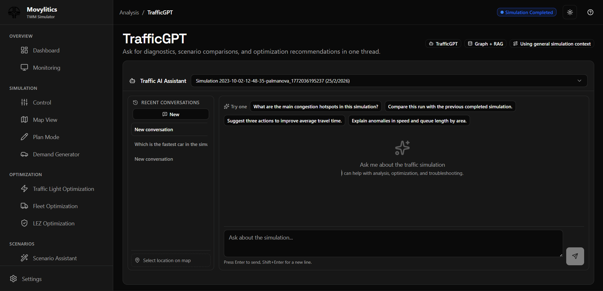
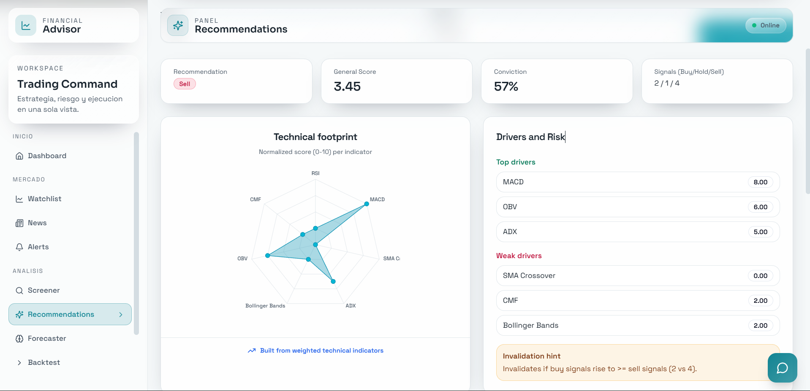

  <h1>
    Pablo Manglano | 
    
  </h1>

  ### From traffic flows to data flows.

  **I build systems that turn complex real-world behaviour into something observable, analysable, and useful.**

  Software engineer building the systems behind smart mobility, simulation, digital twins, and applied AI.

---

## What I Design

I work on backend-heavy systems at the intersection of **traffic simulation**, **urban mobility**, **digital twins**, and **applied AI**.

What interests me most is not just processing data, but building software that helps **model**, **monitor**, and **understand** how complex real-world systems behave.

In practice, that means designing tools for **mobility analytics**, **decision support**, **simulation pipelines**, and **data-driven operational intelligence**.

---

## What I Work On

| Domain | Focus |
|---|---|
| 🧠 Applied AI | AI-assisted analytics, decision-support workflows, operational insight |
| 🏗️ Backend Systems | APIs, pipelines, integrations, observability, scalable architecture |
| 🚦 Smart Mobility | Traffic flow, congestion, emissions, low-emission zones |
| 📈 Financial Tooling | Portfolio analytics, sentiment analysis, signal exploration |

---

## Selected Work

<table>
  <tr>
    <td width="50%" valign="top">
      
      <h3>🚦 Urban Mobility Suite</h3>
      

        Advanced workflows for modeling traffic dynamics and LEZ scenarios. 
    Built with an <b>intelligent query layer</b> that allows for natural language 
    exploration of simulation results and environmental impact reports.
      

      

        <code>Python</code> <code>SUMO</code> <code>TraCI</code> <code>FastAPI</code> <code>GraphRAG</code> <code>Docker</code>
      

    </td>
    <td width="50%" valign="top">
      
      <h3>📈 Financial Advisor</h3>
      

       <b>High-throughput data engine</b> for real-time market ingestion and sentiment exploration. 
    It automates signal extraction from unstructured sources, providing a 
    unified backend for tracking portfolio performance and risk metrics.
      

      

        <code>Python</code> <code>FastAPI</code> <code>APScheduler</code> <code>Redis</code> <code>SQL</code> <code>Grafana</code>
      

    </td>
  </tr>
</table>

---

## Pulse

  

---

**Looking for technical insights or collaboration?** I’m always open to discussing backend architecture, simulation pipelines, or the future of urban mobility. Drop me a line!
