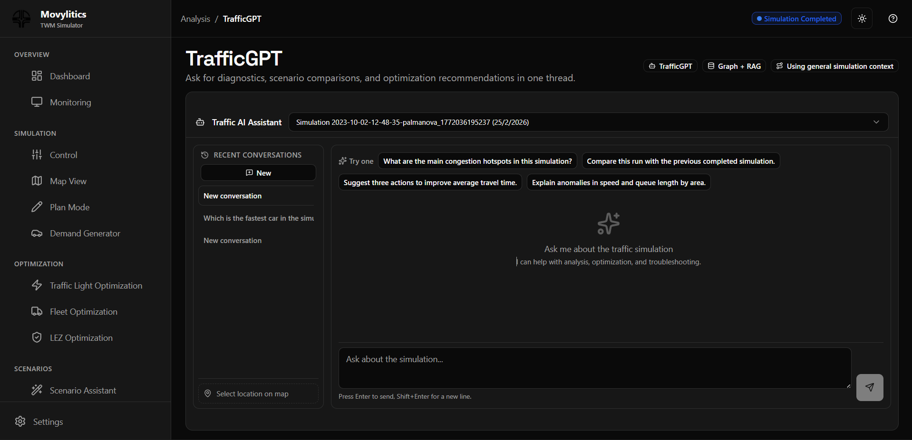
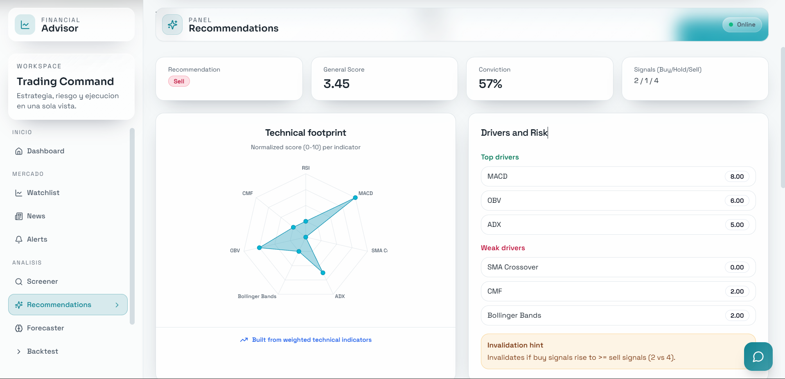

  <h1>
    Pablo Manglano | 
    
  </h1>

## What I Work On

| Domain | Focus |
|---|---|
| 🧠 Applied AI | AI-assisted analytics, decision-support workflows, operational insight |
| 🏗️ Backend Systems | APIs, pipelines, integrations, observability, scalable architecture |
| 🚦 Smart Mobility | Traffic flow, congestion, emissions, low-emission zones |
| 📈 Financial Tooling | Portfolio analytics, sentiment analysis, signal exploration |

---

## Selected Work

<table>
  <tr>
    <td width="50%" valign="top">
      
      <h3>🚦 Urban Mobility Suite</h3>
      

        Advanced workflows for modeling traffic dynamics and LEZ scenarios. 
    Built with an <b>intelligent query layer</b> that allows for natural language 
    exploration of simulation results and environmental impact reports.
      

      

        <code>Python</code> <code>SUMO</code> <code>TraCI</code> <code>FastAPI</code> <code>GraphRAG</code> <code>Docker</code>
      

    </td>
    <td width="50%" valign="top">
      
      <h3>📈 Financial Advisor</h3>
      

       <b>High-throughput data engine</b> for real-time market ingestion and sentiment exploration. 
    It automates signal extraction from unstructured sources, providing a 
    unified backend for tracking portfolio performance and risk metrics.
      

      

        <code>Python</code> <code>FastAPI</code> <code>APScheduler</code> <code>Redis</code> <code>SQL</code> <code>Grafana</code>
      

    </td>
  </tr>
</table>

---

## Pulse

  

