<!-- ───────────────────────────────────────────── -->
<!-- Header / Hero -->
<!-- ───────────────────────────────────────────── -->

  <!-- Title -->
  <h1>Hi, I'm Pablo 👋</h1>
  
<b>Full-Stack · Traffic Simulation · Applied AI</b>

  <!-- Short pitch -->
  

    I build systems around mobility, emissions and real-time data.
    Mostly backend / infra work (Python, FastAPI, Docker),
    and tools to analyze how cities actually move.
  

  <!-- Badges -->
  
   
  

<!-- ───────────────────────────────────────────── -->
<!-- What I'm doing right now -->
<!-- ───────────────────────────────────────────── -->

### 🚦 Current focus

- **Urban Mobility / Emissions sim**  
  Building traffic + pollution simulation pipelines using **SUMO + TraCI**, feeding data into analytics dashboards and optimization models for low-emission zones.

- **Backend & infra**  
  Hexagonal architectures with **FastAPI (Python)**, containerized with Docker, instrumented for metrics.

- **Market / Portfolio tooling**  
  Internal tools for financial data ingest (IBKR, yfinance) + analytics (sentiment, signals, PnL tracking).  
  Basically: “How do I get signal without paying Bloomberg money.”

 

<!-- ───────────────────────────────────────────── -->
<!-- Metrics -->
<!-- ───────────────────────────────────────────── -->

### 📊 GitHub Metrics

<!--
  Auto-generated by .github/workflows/metrics.yml
  Do not edit manually.
-->

  

 

<!-- ───────────────────────────────────────────── -->
<!-- Tech stack -->
<!-- ───────────────────────────────────────────── -->

### 🛠 Languages & tools I actually use

  <!-- Editors / OS -->
  
  
  
  

  <!-- Backend -->
  
  
  
  

  <!-- Data / ML -->
  
  
  
  

  <!-- Infra / Cloud -->
  
  
  
  

